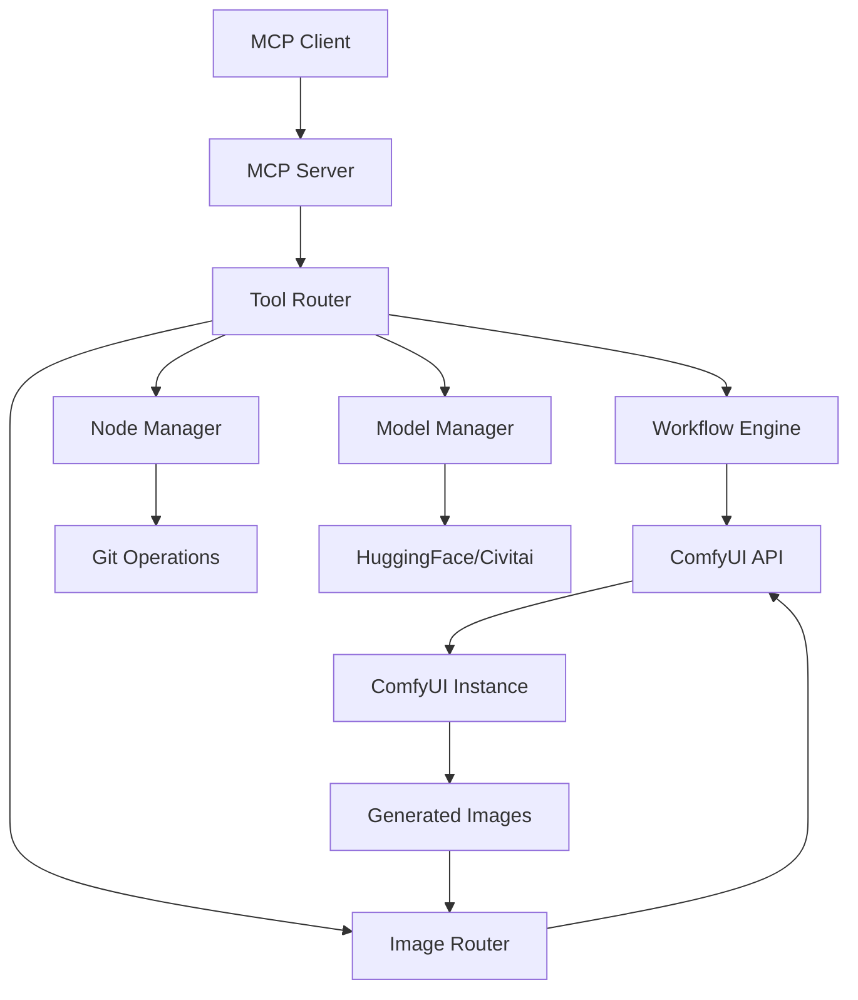

# 🎨 ComfyUI MCP Server

[](https://opensource.org/licenses/MIT)
[](https://nodejs.org/)
[](https://www.typescriptlang.org/)
[](https://github.com/comfyanonymous/ComfyUI)

A **comprehensive Model Context Protocol (MCP) server** for ComfyUI with **automatic agentic controlling capabilities**, **intelligent workflow orchestration**, and **self-improving DGM integration**.

## 🌟 Key Highlights

- 🤖 **Fully Autonomous ComfyUI Control** - Complete API automation with intelligent decision making
- 🔄 **Self-Improving Architecture** - DGM-powered recursive optimization and learning
- 🎭 **Advanced Workflow Orchestration** - Chain complex workflows with dependencies and error handling
- 🖼️ **Intelligent Image Routing** - Automatic image bridging between workflows
- 🔧 **Smart Custom Node Management** - Automated installation with dependency resolution
- 📦 **One-Click ComfyUI Installation** - Complete setup with CUDA optimization options
- 🚀 **Performance Optimization** - Triton and SageAttention integration
- 🔍 **Real-time Monitoring** - System health and performance tracking

## 🎯 Core Capabilities

### 🤖 **Autonomous AI Control**
- **Intelligent Workflow Management**: AI-driven workflow selection and optimization
- **DGM Self-Improvement**: Recursive learning and performance enhancement
- **Automatic Error Recovery**: Smart error detection and resolution
- **Adaptive Performance Tuning**: Dynamic optimization based on system capabilities

### 🎭 **Advanced Workflow System**
- **Workflow Orchestration**: Chain multiple workflows with complex dependencies
- **Parameter Injection**: Dynamic parameter modification for any workflow type
- **Image Routing**: Intelligent bridging of images between workflow stages
- **Batch Processing**: Execute multiple workflows with parallel processing

### 🔧 **Complete ComfyUI Management**
- **Model Download & Management**: HuggingFace, Civitai, and custom model sources
- **Custom Node Ecosystem**: Automated installation, updates, and dependency management
- **Configuration Management**: Dynamic ComfyUI settings and optimization
- **System Integration**: Terminal operations, file management, and monitoring

### 🚀 **Performance & Optimization**
- **CUDA Optimization**: Multi-version CUDA support with automatic selection
- **Triton Integration**: GPU kernel optimization for enhanced performance
- **SageAttention**: Memory-efficient attention mechanisms
- **Resource Monitoring**: Real-time CPU, RAM, and GPU utilization tracking

## 🚀 Quick Start

### Option 1: Complete Installation (Recommended)

**🎯 One-Click ComfyUI Setup with MCP Server**

1. **Clone the repository**:
   ```bash
   git clone https://github.com/your-org/comfyui-mcp-server.git
   cd comfyui-mcp-server
   ```

2. **Install ComfyUI with optimization options**:
   ```bash
   # Run the comprehensive installer
   sandbox/Install_ComfyUI_Complete.bat
   ```

   The installer will guide you through:
   - **CUDA Version Selection** (11.8, 12.1, 12.4, 12.6, or CPU-only)
   - **Triton & SageAttention** optimization options
   - **Build Tools** validation and setup
   - **Automatic Environment** configuration

3. **Install MCP Server dependencies**:
   ```bash
   npm install
   npm run build
   ```

4. **Start the MCP Server**:
   ```bash
   npm start
   # or
   start-comfyui-mcp.bat
   ```

### Option 2: MCP Server Only

If you already have ComfyUI installed:

1. **Clone and setup**:
   ```bash
   git clone https://github.com/your-org/comfyui-mcp-server.git
   cd comfyui-mcp-server
   npm install
   npm run build
   ```

2. **Configure ComfyUI path** in `augment-mcp-config.json`

3. **Start the server**:
   ```bash
   npm start
   ```

## 📋 System Requirements

### **Minimum Requirements**
- **Node.js**: 18.0.0 or higher
- **Python**: 3.10+ (for ComfyUI)
- **RAM**: 8GB minimum, 16GB+ recommended
- **Storage**: 20GB+ free space for models

### **Recommended for Optimal Performance**
- **GPU**: NVIDIA RTX 3060+ with 8GB+ VRAM
- **CUDA**: 12.6 (latest) or 11.8+ (compatible)
- **RAM**: 32GB+ for large models
- **Storage**: SSD with 100GB+ free space
- **Build Tools**: Visual Studio 2019/2022 (for Triton/SageAttention)

## 🎮 Usage Guide

### 🚀 Starting the System

#### **Method 1: Complete System Startup**
```bash
# Start ComfyUI instance (if using our installer)
sandbox/ComfyUI_cuda126/Launch_ComfyUI_CUDA126.bat

# In another terminal, start MCP Server
npm start
# or
start-comfyui-mcp.bat
```

#### **Method 2: Direct MCP Server**
```bash
npm start
# or
node build/index.js
```

### 🎭 **Advanced Workflow System**

#### **🔥 Single Workflow Execution**
Execute individual workflows with dynamic parameter injection:

```javascript
// Basic execution
Tool: run_workflow_with_parameters
Parameters:
- workflowName: "text2img_api"
- parameters: {
    "positive_prompt": "beautiful landscape, 4k, detailed",
    "negative_prompt": "blurry, low quality",
    "width": 1920,
    "height": 1080,
    "batch_size": 4,
    "steps": 20,
    "cfg": 7.0,
    "seed": -1
  }
```

#### **🎭 Workflow Orchestration**
Chain multiple workflows with intelligent dependencies:

```javascript
// Create workflow chain
Tool: create_workflow_chain
Parameters:
- name: "text2img_to_upscale_pipeline"
- description: "Generate image then upscale"
- steps: [
    {
      "id": "generate",
      "workflowFile": "text2img_api",
      "parameters": {"batch_size": 1, "seed": 42}
    },
    {
      "id": "upscale",
      "workflowFile": "upscaling_api",
      "dependencies": ["generate"],
      "routeFromPrevious": true
    }
  ]

// Execute the chain
Tool: execute_workflow_chain
Parameters:
- chainId: "returned-chain-id"
- dryRun: false
```

#### **🖼️ Intelligent Image Routing**
Automatically bridge images between workflows:

```javascript
// Smart image routing with ML-like decision making
Tool: smart_route_image
Parameters:
- workflowFile: "upscaling_api"
- confidenceThreshold: 0.8
- learningMode: true

// Batch image routing
Tool: batch_route_images
Parameters:
- routingConfig: [
    {
      "workflowFile": "upscaling_api",
      "imagePattern": "*.png",
      "count": 5
    }
  ]
```

#### **🔧 Custom Node Management**
Install and manage ComfyUI custom nodes automatically:

```javascript
// Install custom node with automatic dependency resolution
Tool: install_customnodes
Parameters:
- nodeUrl: "https://github.com/kijai/ComfyUI-KJNodes"
- comfyuiPath: "C:/path/to/ComfyUI"
- skipDependencies: false

// List all installed custom nodes
Tool: list_custom_nodes
Parameters:
- comfyuiPath: "C:/path/to/ComfyUI"
- detailed: true
```

## ⚙️ Configuration

### 🔧 **MCP Client Configuration**

#### **Claude Desktop Configuration**
Add to your `claude_desktop_config.json`:

```json
{
  "mcpServers": {
    "comfyui": {
      "command": "node",
      "args": ["C:/path/to/comfyui-mcp-server/build/index.js"],
      "env": {
        "COMFYUI_PATH": "C:/path/to/ComfyUI",
        "COMFYUI_URL": "http://127.0.0.1:8188"
      }
    }
  }
}
```

#### **Augment MCP Configuration**
Add to your `augment-mcp-config.json`:

```json
{
  "mcpServers": {
    "comfyui-mcp-server": {
      "command": "C:/path/to/comfyui-mcp-server/mcp-server.bat",
      "args": [],
      "env": {
        "NODE_ENV": "production"
      }
    }
  }
}
```

#### **VS Code with MCP Extension**
```json
{
  "mcp.servers": {
    "comfyui": {
      "command": "node",
      "args": ["./build/index.js"],
      "cwd": "C:/path/to/comfyui-mcp-server"
    }
  }
}
```

### 🎛️ **Server Configuration**

#### **Environment Variables**
Create a `.env` file in the project root:

```env
# ComfyUI Configuration
COMFYUI_PATH=C:/path/to/ComfyUI
COMFYUI_URL=http://127.0.0.1:8188
COMFYUI_MODELS_PATH=C:/path/to/ComfyUI/models

# Performance Settings
MAX_CONCURRENT_WORKFLOWS=3
WORKFLOW_TIMEOUT=300000
IMAGE_ROUTING_CONFIDENCE=0.7

# Monitoring
ENABLE_PERFORMANCE_MONITORING=true
LOG_LEVEL=info

# DGM Integration
ENABLE_DGM_OPTIMIZATION=true
RECURSIVE_IMPROVEMENT_CYCLES=5
```

#### **Advanced Configuration**
Modify `src/config.ts` for advanced settings:

```typescript
export const config = {
  comfyui: {
    defaultUrl: 'http://127.0.0.1:8188',
    timeout: 30000,
    retryAttempts: 3
  },
  workflows: {
    directory: './workflows',
    maxConcurrent: 3,
    defaultParameters: {
      batch_size: 1,
      steps: 20,
      cfg: 7.0
    }
  },
  optimization: {
    enableTriton: true,
    enableSageAttention: true,
    autoOptimize: true
  }
};
```

## 🛠️ Available Tools

### 🎯 **Core Workflow Management**
| Tool | Description | Key Features |
|------|-------------|--------------|
| `run_workflow_with_parameters` | Execute workflows with dynamic parameter injection | ✅ Parameter modification, ✅ Preset configurations |
| `run_workflow` | Basic workflow execution from workflows folder | ✅ Simple execution, ✅ API format support |
| `create_workflow_chain` | Create complex workflow orchestration chains | ✅ Dependencies, ✅ Error handling, ✅ Conditional execution |
| `execute_workflow_chain` | Execute workflow chains with monitoring | ✅ Progress tracking, ✅ Dry run mode |
| `load_workflow` | Load and validate workflow files | ✅ Structure validation, ✅ Error detection |
| `optimize_workflow` | AI-powered workflow optimization | ✅ Performance tuning, ✅ Resource optimization |

### 🖼️ **Intelligent Image Routing**
| Tool | Description | Key Features |
|------|-------------|--------------|
| `fetch_latest_image` | Smart image detection and routing | ✅ Auto-detection, ✅ Node routing, ✅ Path resolution |
| `smart_route_image` | ML-like image routing with confidence scoring | ✅ Confidence thresholds, ✅ Learning mode |
| `batch_route_images` | Batch image processing and routing | ✅ Pattern matching, ✅ Multi-workflow support |
| `orchestrate_workflow_with_images` | Complete workflow orchestration with image bridging | ✅ Automatic chaining, ✅ Image flow management |
| `analyze_output_images` | Image analysis with metadata extraction | ✅ Metadata parsing, ✅ Workflow grouping |

### 🔧 **Custom Node Ecosystem**
| Tool | Description | Key Features |
|------|-------------|--------------|
| `install_customnodes` | **🌟 FEATURED** Intelligent custom node installation | ✅ Git clone, ✅ Dependency resolution, ✅ README parsing |
| `list_custom_nodes` | Comprehensive custom node inventory | ✅ Detailed info, ✅ Status checking |
| `update_custom_node` | Smart custom node updates | ✅ Git pull, ✅ Dependency updates |
| `remove_custom_node` | Safe custom node removal | ✅ Complete cleanup, ✅ Confirmation prompts |
| `install_requirements` | Intelligent dependency installation | ✅ README analysis, ✅ Environment detection |

### 📦 **Model Management**
| Tool | Description | Key Features |
|------|-------------|--------------|
| `download_huggingface_model` | HuggingFace model downloads | ✅ Authentication, ✅ Progress tracking |
| `list_installed_models` | Model inventory and organization | ✅ Type filtering, ✅ Size information |
| `check_disk_space` | Storage monitoring | ✅ Space analysis, ✅ Cleanup suggestions |

### 🚀 **ComfyUI Server Management**
| Tool | Description | Key Features |
|------|-------------|--------------|
| `start_comfyui_in_terminal` | Intelligent ComfyUI startup | ✅ Auto-detection, ✅ Multiple methods |
| `get_server_status` | Server health monitoring | ✅ API status, ✅ Performance metrics |
| `queue_workflow` | Workflow queue management | ✅ Priority handling, ✅ Client tracking |
| `clear_queue` | Queue management and cleanup | ✅ Selective clearing, ✅ Process termination |
| `kill_comfyui_processes` | Process and port cleanup | ✅ Force termination, ✅ Port cleanup |

### 🔍 **System Monitoring & Diagnostics**
| Tool | Description | Key Features |
|------|-------------|--------------|
| `monitor_system_resources` | Real-time system monitoring | ✅ CPU/RAM/GPU tracking, ✅ Performance alerts |
| `health_check` | Comprehensive system health analysis | ✅ Multi-component checking, ✅ Issue detection |
| `execute_command` | Safe command execution | ✅ Timeout handling, ✅ Output capture |

### 🎛️ **Configuration & Settings**
| Tool | Description | Key Features |
|------|-------------|--------------|
| `get_comfyui_config` | Configuration management | ✅ Settings retrieval, ✅ Validation |
| `api_key_management` | API key and credential management | ✅ Secure storage, ✅ Validation |

### 🔄 **Batch Operations & Automation**
| Tool | Description | Key Features |
|------|-------------|--------------|
| `batch_workflow_execution` | Multi-workflow batch processing | ✅ Concurrent execution, ✅ Progress tracking |
| `create_directory` | Directory management | ✅ Recursive creation, ✅ Permission handling |
| `list_directory` | File system exploration | ✅ Detailed listings, ✅ Hidden file support |

> **🎯 Pro Tip**: Use workflow chains with image routing for complete automation pipelines. The system can automatically generate images, route them through upscaling, apply effects, and organize outputs - all with a single command!

## 🏗️ Architecture

### **🔧 Modular Design**
The server follows a clean, modular architecture for maximum maintainability and extensibility:

```
📁 comfyui-mcp-server/
├── 📁 src/
│   ├── 📄 index.ts                 # 🚀 Main MCP server entry point
│   ├── 📁 core/
│   │   ├── 📄 server.ts            # Core MCP server implementation
│   │   ├── 📄 config.ts            # Configuration management
│   │   └── 📄 utils.ts             # Shared utilities
│   └── 📁 tools/
│       ├── 📄 workflowExecution.ts # 🎭 Workflow orchestration & execution
│       ├── 📄 imageRouting.ts      # 🖼️ Intelligent image routing
│       ├── 📄 customNodes.ts       # 🔧 Custom node management
│       ├── 📄 modelManagement.ts   # 📦 Model download & organization
│       ├── 📄 serverManagement.ts  # 🚀 ComfyUI server control
│       ├── 📄 systemMonitoring.ts  # 🔍 Performance monitoring
│       ├── 📄 fileOperations.ts    # 📁 File & directory operations
│       └── 📄 batchOperations.ts   # 🔄 Batch processing
├── 📁 build/                       # 🏗️ Compiled JavaScript output
├── 📁 workflows/                   # 🎭 Workflow templates
├── 📁 sandbox/                     # 📦 Installation scripts
└── 📁 state/                       # 💾 Runtime state management
```

### **🔄 Data Flow Architecture**



### **🧠 Intelligent Systems**

#### **DGM Self-Improvement Loop**
```
Performance Analysis → Pattern Recognition → Optimization → Implementation → Validation → Learning
```

#### **Image Routing Intelligence**
```
Image Detection → Compatibility Analysis → Confidence Scoring → Route Selection → Execution
```

## 🛠️ Development

### **🚀 Quick Development Setup**
```bash
# Clone and setup
git clone https://github.com/your-org/comfyui-mcp-server.git
cd comfyui-mcp-server

# Install dependencies
npm install

# Development mode with hot reload
npm run dev

# Build for production
npm run build

# Run tests
npm test

# Lint and format
npm run lint
npm run format
```

### **🔧 Development Scripts**
| Command | Description | Usage |
|---------|-------------|-------|
| `npm run dev` | Development mode with TypeScript watching | Real-time development |
| `npm run build` | Compile TypeScript to JavaScript | Production builds |
| `npm test` | Run Jest test suite | Quality assurance |
| `npm run lint` | ESLint code analysis | Code quality |
| `npm run format` | Prettier code formatting | Code consistency |

### **🧪 Testing Strategy**
```bash
# Unit tests
npm run test:unit

# Integration tests
npm run test:integration

# End-to-end tests
npm run test:e2e

# Coverage report
npm run test:coverage
```

## 🛡️ Error Handling & Reliability

### **🔒 Comprehensive Error Management**
- **Graceful Degradation**: System continues operating even when components fail
- **Detailed Logging**: Comprehensive error tracking with context
- **Automatic Recovery**: Self-healing mechanisms for common issues
- **Performance Monitoring**: Real-time system health tracking
- **Timeout Handling**: Prevents hanging operations
- **Resource Cleanup**: Automatic cleanup of failed operations

### **🔍 Monitoring & Diagnostics**
```javascript
// Built-in health monitoring
{
  "system": {
    "status": "healthy",
    "uptime": "2h 34m",
    "memory": "1.2GB / 16GB",
    "cpu": "15%",
    "gpu": "45%"
  },
  "comfyui": {
    "status": "running",
    "queue": 2,
    "processing": true
  },
  "workflows": {
    "completed": 156,
    "failed": 3,
    "success_rate": "98.1%"
  }
}
```

## 🚀 Performance Optimization

### **⚡ CUDA & GPU Acceleration**
The installation script provides multiple CUDA options for optimal performance:

| CUDA Version | Compatibility | Performance | Recommended For |
|--------------|---------------|-------------|-----------------|
| **CUDA 12.6** | Latest GPUs | ⭐⭐⭐⭐⭐ | RTX 40 series, Latest hardware |
| **CUDA 12.4** | Modern GPUs | ⭐⭐⭐⭐ | RTX 30/40 series |
| **CUDA 12.1** | Balanced | ⭐⭐⭐ | Most modern GPUs |
| **CUDA 11.8** | Wide compatibility | ⭐⭐ | Older GPUs, Stability |
| **CPU Only** | Universal | ⭐ | Testing, CPU-only systems |

### **🔥 Advanced Optimizations**
- **Triton Integration**: GPU kernel optimization for 20-40% performance boost
- **SageAttention**: Memory-efficient attention for large models
- **Automatic Mixed Precision**: Reduces memory usage while maintaining quality
- **Dynamic Batching**: Optimizes batch sizes based on available VRAM

## 📚 Examples & Use Cases

### **🎨 Creative Workflows**
```javascript
// Generate and enhance artwork pipeline
{
  "name": "artistic_enhancement_pipeline",
  "steps": [
    {
      "id": "base_generation",
      "workflow": "text2img_api",
      "parameters": {
        "prompt": "digital art, concept art style",
        "steps": 30,
        "cfg": 8.0
      }
    },
    {
      "id": "upscale_enhance",
      "workflow": "upscaling_api",
      "dependencies": ["base_generation"],
      "routeFromPrevious": true
    }
  ]
}
```

### **📸 Photography Enhancement**
```javascript
// Photo restoration and enhancement
{
  "workflow": "photo_enhancement",
  "batch_processing": true,
  "input_directory": "./photos",
  "output_directory": "./enhanced",
  "parameters": {
    "denoise_strength": 0.7,
    "upscale_factor": 2.0,
    "color_correction": true
  }
}
```

### **🎬 Video Frame Processing**
```javascript
// Video frame extraction and processing
{
  "pipeline": "video_frame_enhancement",
  "input": "video.mp4",
  "frame_extraction": {
    "fps": 24,
    "quality": "high"
  },
  "processing": {
    "workflow": "frame_enhancement_api",
    "batch_size": 8
  }
}
```

## 🤝 Contributing

### **🔧 Development Contribution**
1. **Fork** the repository
2. **Create** a feature branch: `git checkout -b feature/amazing-feature`
3. **Implement** your changes with tests
4. **Ensure** all tests pass: `npm test`
5. **Submit** a pull request with detailed description

### **📝 Documentation Contribution**
- Improve README sections
- Add workflow examples
- Create tutorial content
- Update API documentation

### **🐛 Bug Reports**
Please include:
- System specifications
- ComfyUI version
- Error logs and stack traces
- Steps to reproduce

### **💡 Feature Requests**
- Describe the use case
- Explain expected behavior
- Provide implementation suggestions

## 📄 License

**MIT License** - see [LICENSE](LICENSE) file for details.

This project is open source and welcomes contributions from the community.

## 🆘 Support & Community

### **📞 Getting Help**
- 📖 **Documentation**: Check this README and tool documentation
- 🐛 **Issues**: [GitHub Issues](https://github.com/your-org/comfyui-mcp-server/issues)
- 💬 **Discussions**: [GitHub Discussions](https://github.com/your-org/comfyui-mcp-server/discussions)
- 📧 **Email**: support@your-org.com

### **🔧 Troubleshooting**

#### **Common Issues**
| Issue | Solution |
|-------|----------|
| ComfyUI not starting | Check CUDA installation and Python environment |
| Models not downloading | Verify internet connection and API keys |
| Workflows failing | Validate workflow JSON format and node compatibility |
| Performance issues | Enable Triton/SageAttention optimizations |

#### **Debug Mode**
```bash
# Enable verbose logging
DEBUG=comfyui:* npm start

# Check system health
npm run health-check

# Validate installation
npm run validate-setup
```

### **🌟 Community**
Join our growing community of AI artists, developers, and researchers using ComfyUI MCP Server for creative and technical projects.

---

**⭐ Star this repository if you find it useful!**

**🔄 Watch for updates and new features**

**🤝 Contribute to make it even better**
